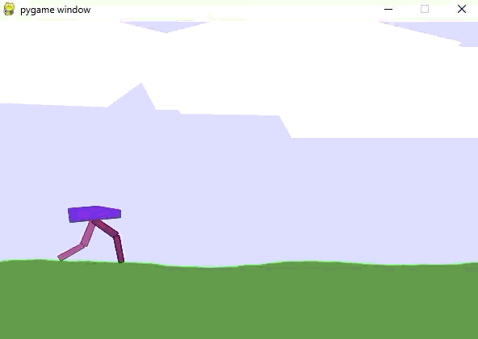

# 项目介绍

基于Pytorch实现 Soft_Q-learning (Gymnasium的BipedalWalker-v3游戏环境)

## 原理笔记

[我的笔记](https://markdown.com.cn)

## 环境依赖

- Python 3.11.15
- gymnasium 1.3.0
- torch 2.13.0（cu132 Nightly 版本）
- tensorboard（`torch.utils.tensorboard` 依赖）

> 显卡为 RTX 5060 时，PyTorch 建议安装最新的 Nightly 版本（cu132）：

```bash
pip3 install --pre torch torchvision --index-url https://download.pytorch.org/whl/nightly/cu132
```

安装其余依赖：

```bash
pip install gymnasium tensorboard
```

## 训练

在config.py中设置超参数。

进行训练：

```bash
python main.py
```

## 测试

进行测试：

```bash
python test.py
```

根据提示输入从文件夹model导入的模型以及测试游戏的局数。

```bash
请输入模型文件名(.pth)：best_262.pth
请输入测试环境几局：3
```

效果：




